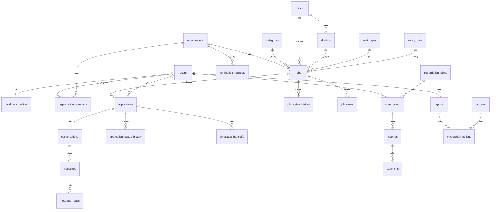
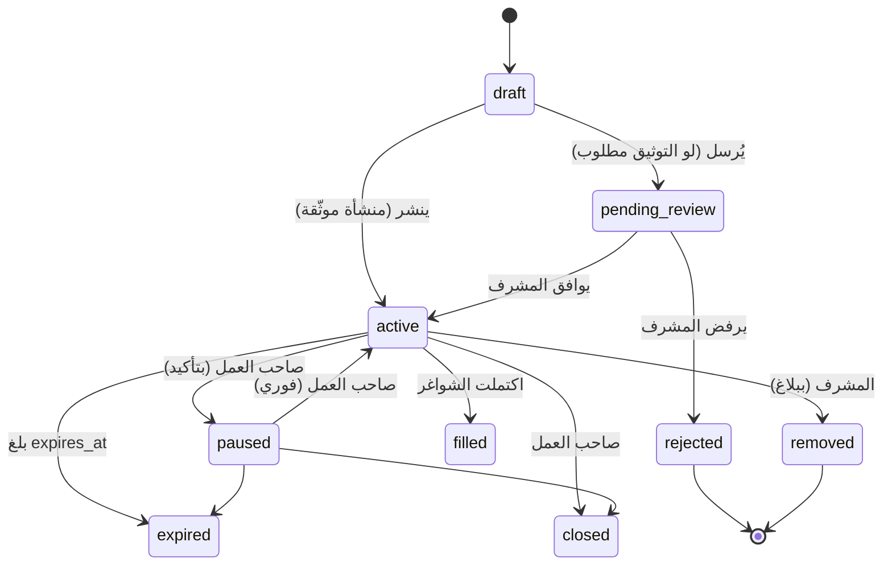
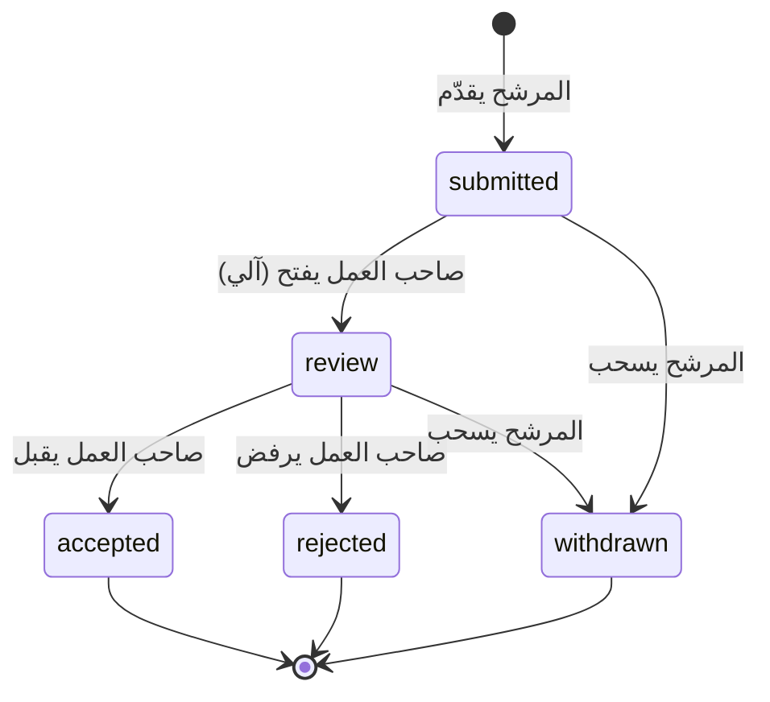

# zeno — نموذج الدومين وسكيما قاعدة البيانات
### Domain Model & Database Schema

> **الحالة:** جاهز للمراجعة · **آخر تحديث:** 21 يوليو 2026
> **يبني على:** [22-open-decisions](22-open-decisions-and-product-questions.md) (23 قرار محسوم) · [18-architecture-and-stack](18-architecture-and-stack.md)
> **المخرَج:** أول migration في المشروع — مُخرَج سبرنت 0

---

## 0. الاصطلاحات

| البند | القاعدة |
|---|---|
| المحرك | **PostgreSQL 16 + PostGIS 3.4** |
| أسماء الجداول | جمع، `snake_case` — `job_status_history` |
| المفتاح الأساسي | `id BIGSERIAL` — إلا ما يُذكر |
| المفاتيح الأجنبية | `<singular>_id` مع `ON DELETE` صريح دائماً |
| التوقيتات | `TIMESTAMPTZ` **دائماً** — لا `TIMESTAMP` مجرداً |
| المنطقة الزمنية | التخزين UTC · العرض `Asia/Riyadh` |
| الـ Enums | `VARCHAR` + `CHECK` — مدعومة بـ PHP enum |
| المال | `NUMERIC(10,2)` — **ممنوع `FLOAT`** |
| الجغرافيا | `GEOGRAPHY(Point, 4326)` + فهرس `GIST` |
| النصوص الحرة | `TEXT` — لا `VARCHAR(255)` اعتباطي |
| JSON | `JSONB` + فهرس `GIN` عند البحث |

### 0.1 تصنيف الحساسية (PDPL)

كل عمود مُعلَّم بواحد من:

| الرمز | التصنيف | التعامل |
|---|---|---|
| 🟢 | عام | يظهر في الواجهات العامة |
| 🟡 | داخلي | يحتاج مصادقة |
| 🟠 | شخصي | بيانات شخصية — وصول مقيّد + سجل |
| 🔴 | حساس | هوية/سجل تجاري/دفع — **مشفّر + دور `verifier` فقط** |

### 0.2 لماذا PostgreSQL + PostGIS

| السبب | التفصيل |
|---|---|
| **البحث النصف قطري** | `ST_DWithin` على `GEOGRAPHY` مع فهرس GIST — الترتيب بالمسافة استعلام واحد. جوهر المنتج |
| **الفهارس الجزئية** | تحل «طلب واحد لكل مرشح لكل وظيفة **مع السماح بإعادة التقديم بعد السحب**» بفهرس واحد — MySQL لا يدعمها |
| **JSONB + GIN** | المهارات والبيانات الوصفية بلا جداول إضافية |
| **قيود CHECK حقيقية** | MySQL تجاهلها تاريخياً؛ Postgres يفرضها |
| **المعاملات** | سباق الشواغر (D-13) يحتاج `SELECT … FOR UPDATE` موثوقاً |

---

## 1. مخطط العلاقات



---

## 2. الهوية والوصول

### 2.1 `users` — المرشحون وأصحاب العمل

> **مبدأ:** جدول واحد للطرفين. الدور يحدد الملف المرتبط. **المديرون في جدول منفصل** (§2.5).

| العمود | النوع | Null | افتراضي | حساسية | ملاحظة |
|---|---|---|---|---|---|
| `id` | BIGSERIAL | ✗ | | 🟡 | PK |
| `uuid` | UUID | ✗ | `gen_random_uuid()` | 🟡 | المعرّف العام — لا يُكشف `id` |
| `phone_e164` | VARCHAR(16) | ✗ | | 🟠 | `+9665XXXXXXXX` — **UNIQUE** |
| `phone_verified_at` | TIMESTAMPTZ | ✓ | | 🟡 | |
| `role` | VARCHAR(20) | ✗ | | 🟡 | `candidate` \| `employer` |
| `email` | VARCHAR(255) | ✓ | | 🟠 | اختياري (وصف المشروع ص1–2) |
| `status` | VARCHAR(20) | ✗ | `'active'` | 🟡 | `active` \| `suspended` \| `deleted` |
| `suspended_reason` | TEXT | ✓ | | 🟡 | إلزامي عند `suspended` |
| `suspended_at` | TIMESTAMPTZ | ✓ | | 🟡 | |
| `locale` | VARCHAR(5) | ✗ | `'ar'` | 🟢 | جاهزية D-36 |
| `last_active_at` | TIMESTAMPTZ | ✓ | | 🟡 | |
| `created_at` / `updated_at` | TIMESTAMPTZ | ✗ | | 🟡 | |
| `deleted_at` | TIMESTAMPTZ | ✓ | | 🟡 | حذف ناعم |

```sql
UNIQUE (phone_e164) WHERE deleted_at IS NULL      -- الرقم يُعاد استخدامه بعد الحذف
CHECK  (role   IN ('candidate','employer'))
CHECK  (status IN ('active','suspended','deleted'))
CHECK  (status <> 'suspended' OR suspended_reason IS NOT NULL)
INDEX  (role, status) · (uuid) · (last_active_at DESC)
```

> **⚠️ ملاحظة D-27:** **لا يوجد ولا سيوجد عمود إحداثيات في هذا الجدول.** الموقع يُرسل في الطلب ويُهمَل. اختبار معماري في سبرنت 4 يفرض ذلك.

**الاحتفاظ:** الحذف الناعم يخفي فوراً · التصفية الكاملة بعد **90 يوماً** (وظيفة مجدولة) · `phone_e164` يُجزّأ (hash) عند التصفية لمنع إعادة التسجيل الفوري بنفس الرقم.

### 2.2 `candidate_profiles`

حقول وصف المشروع ص2 كاملة.

| العمود | النوع | Null | حساسية | ملاحظة |
|---|---|---|---|---|
| `id` · `user_id` | BIGSERIAL · BIGINT | ✗ | 🟡 | UNIQUE, CASCADE |
| `full_name` | VARCHAR(120) | ✗ | 🟠 | |
| `national_id` | VARCHAR(20) | ✓ | 🔴 | **مشفّر** — يُطلب عند التوثيق فقط (D-16) |
| `national_id_type` | VARCHAR(10) | ✓ | 🔴 | `national` \| `iqama` |
| `birth_date` | DATE | ✓ | 🟠 | العمر يُشتقّ — **لا يُخزَّن** |
| `nationality_code` | CHAR(2) | ✓ | 🟠 | ISO 3166-1 |
| `city_id` | BIGINT | ✓ | 🟢 | RESTRICT |
| `job_title` | VARCHAR(120) | ✓ | 🟢 | المهنة الحالية أو المستهدفة |
| `years_of_experience` | SMALLINT | ✓ | 🟢 | 0–60 |
| `skills` | JSONB | ✗ | 🟢 | `[]` — فهرس GIN |
| `bio` | TEXT | ✓ | 🟢 | نبذة مختصرة |
| `completion_percentage` | SMALLINT | ✗ | 🟡 | مُشتقّ ومخزَّن للفرز |

```sql
CHECK (years_of_experience BETWEEN 0 AND 60)
CHECK (birth_date IS NULL OR birth_date <= CURRENT_DATE - INTERVAL '15 years')
INDEX GIN (skills) · (city_id)
```

> **`birth_date` لا `age`:** البروتوتايب خزّن `age:26` — رقم يفسد بعد سنة. والاشتقاق يمنع بيانات بائتة.

**الصورة الشخصية:** عبر `spatie/laravel-medialibrary` (D-34) — لا عمود مسار.

### 2.3 `organizations` — الفرد والمنشأة (D-06 · D-08)

> **حتى صاحب العمل الفرد له `organization` من نوع `individual`** — فمسار الملكية والصلاحيات واحد.

| العمود | النوع | Null | حساسية | ملاحظة |
|---|---|---|---|---|
| `id` · `uuid` | BIGSERIAL · UUID | ✗ | 🟡 | |
| `type` | VARCHAR(20) | ✗ | 🟢 | `individual` \| `company` |
| `name` | VARCHAR(160) | ✗ | 🟢 | اسم المنشأة أو الفرد |
| `slug` | VARCHAR(180) | ✗ | 🟢 | UNIQUE — SEO |
| `commercial_registration` | VARCHAR(20) | ✓ | 🔴 | **مشفّر** — للمنشأة فقط |
| `responsible_person_name` | VARCHAR(120) | ✓ | 🟠 | وصف المشروع ص1 |
| `city_id` | BIGINT | ✓ | 🟢 | |
| `about` | TEXT | ✓ | 🟢 | |
| `verification_status` | VARCHAR(20) | ✗ | 🟢 | `unverified` \| `pending` \| `verified` \| `rejected` |
| `verified_at` | TIMESTAMPTZ | ✓ | 🟢 | |
| `status` | VARCHAR(20) | ✗ | 🟡 | `active` \| `suspended` |

```sql
CHECK (type IN ('individual','company'))
CHECK (type <> 'company' OR commercial_registration IS NOT NULL)
CHECK (verification_status IN ('unverified','pending','verified','rejected'))
UNIQUE (slug) · UNIQUE (commercial_registration) WHERE commercial_registration IS NOT NULL
```

> **`verification_status` منفصل عن `status`:** الأول ثقة، الثاني وصول. الخلط بينهما هو ما جعل شارة التوثيق في البروتوتايب بلا معنى (D-17).

### 2.4 `organization_members`

> **الإصدار الأول: صف واحد بدور `owner` ولا واجهة دعوة.** الجدول موجود لأن إضافته لاحقاً تعني تعديل كل استعلام ملكية وكل policy (D-06).

| العمود | النوع | ملاحظة |
|---|---|---|
| `organization_id` · `user_id` | BIGINT | CASCADE |
| `role` | VARCHAR(20) | `owner` \| `manager` \| `recruiter` |
| `joined_at` | TIMESTAMPTZ | |

```sql
PRIMARY KEY (organization_id, user_id)
UNIQUE (organization_id) WHERE role = 'owner'      -- مالك واحد فقط
INDEX (user_id)
```

### 2.5 `admins` — منفصل تماماً (D-31)

> **لا يشترك مع `users` في أي شيء.** المديرون لا يُنشأون بـ OTP ولا يملكون تسجيلاً ذاتياً، فلا يمكن لخطأ في منطق الأدوار أن يرفّع مستخدماً إلى مدير.

| العمود | النوع | Null | ملاحظة |
|---|---|---|---|
| `id` · `uuid` | BIGSERIAL · UUID | ✗ | |
| `name` · `email` | VARCHAR | ✗ | UNIQUE على البريد |
| `password` | VARCHAR(255) | ✗ | bcrypt |
| `two_factor_secret` | TEXT | ✓ | 🔴 مشفّر — **MFA إجباري** |
| `two_factor_confirmed_at` | TIMESTAMPTZ | ✓ | بدونه لا وصول |
| `status` | VARCHAR(20) | ✗ | `active` \| `disabled` |
| `last_login_at` / `last_login_ip` | TIMESTAMPTZ · INET | ✓ | |

الأدوار الثلاثة (N-2) عبر `spatie/laravel-permission` بحارس `admin`: `super_admin` · `moderator` · `verifier`.

### 2.6 `otp_challenges`

| العمود | النوع | ملاحظة |
|---|---|---|
| `id` · `phone_e164` | BIGSERIAL · VARCHAR(16) | 🟠 |
| `code_hash` | VARCHAR(255) | 🔴 **مجزّأ لا مخزَّن نصاً** |
| `purpose` | VARCHAR(20) | `login` \| `phone_change` \| `account_deletion` |
| `attempts` | SMALLINT | افتراضي 0 |
| `expires_at` · `consumed_at` | TIMESTAMPTZ | |
| `ip_address` · `user_agent` | INET · TEXT | 🟡 لكشف الإساءة |

```sql
INDEX (phone_e164, purpose, expires_at DESC)
INDEX (expires_at)     -- للتنظيف المجدول
```

المهل وحدود المحاولات من `settings` (N-1) لا من الكود.

**الاحتفاظ:** حذف بعد **24 ساعة** من الانتهاء.

### 2.7 `devices` · `legal_acceptances`

**`devices`** — `user_id` · `platform` (`ios`\|`android`) · `push_token` 🟠 · `app_version` · `last_seen_at`. مفتاح فريد `(user_id, push_token)`.

**`legal_acceptances`** — `user_id` · `legal_document_version_id` · `accepted_at` · `ip_address`. مطلب PDPL: إثبات **أي نسخة** وافق عليها المستخدم.

---

## 3. البيانات المرجعية (N-1)

### 3.1 المُدارة بالكامل — إضافة وتعديل وحذف

**`categories`** — التصنيفات العشرة من وصف المشروع ص3.

| العمود | النوع | ملاحظة |
|---|---|---|
| `code` | VARCHAR(30) | UNIQUE — ثابت بالإنجليزية |
| `name` | JSONB | `{"ar":"مطاعم ومقاهي"}` — translatable |
| `icon` | VARCHAR(50) | من سجل Iconsax المُتحقَّق |
| `color_token` | VARCHAR(30) | زوج الألوان من `HANDOVER §4.1` |
| `sort_order` · `is_active` | SMALLINT · BOOLEAN | |

**البذور:** `restaurants` · `cleaning` · `logistics` · `events` · `retail` · `security` · `operations` · `crafts` · `seasonal_work` · `other`

> **`seasonal_work` لا `season`** — يمنع تصادم التوكن مع نوع الدوام `seasonal` (D-04).

**`cities`** — `code` · `name` JSONB · `region` · `center_point` GEOGRAPHY · `is_active`
**`districts`** — `city_id` · `code` · `name` JSONB · `boundary` GEOGRAPHY(Polygon) ✓ · `is_active`
**`search_radii`** — `value_km` SMALLINT · `sort_order` · `is_active` — بذور: 1, 3, 5, 10, 20, 50
**`report_reasons`** — `code` · `name` JSONB · `target_type` · `sort_order` · `is_active`

### 3.2 المُدارة جزئياً — تعديل المسمى والترتيب والتفعيل فقط

> جميعها تحمل `is_system BOOLEAN NOT NULL DEFAULT true`. **الحذف محجوب على مستوى الـ Policy وقاعدة البيانات.**

**`work_types`** — الأنواع السبعة من وصف المشروع ص4:
`full_time` · `part_time` · `daily` · `weekly` · `seasonal` · `temporary` · `hourly`

**`salary_units`** — `monthly` · `weekly` · `daily` · `hourly`
**`gender_requirements`** — `all` · `men` · `women`
**`nationality_requirements`** — `all` · `saudi` · `non_saudi`

```sql
-- على الأربعة
CREATE RULE no_delete_system AS ON DELETE TO work_types
  WHERE OLD.is_system DO INSTEAD NOTHING;
```

> **لماذا جداول لا PHP enums؟** لأن N-1 يوجب ظهورها في لوحة الإدارة. ولماذا محمية من الحذف؟ لأن حذف «دوام جزئي» يكسر وظائف قائمة وشاشات فلترة. **هذا هو الحل الوسط الذي حسمه N-1 — منفَّذاً على مستوى القاعدة لا على النية.**

---

## 4. الوظائف

### 4.1 `jobs` — السكيما الكانونية (D-02)

> اتحاد حقول الأسطح الثلاثة **زائد** حقول وصف المشروع الغائبة عن التصميم (D-09 · D-10 · D-11).

| العمود | النوع | Null | افتراضي | حساسية | مصدر |
|---|---|---|---|---|---|
| `id` · `uuid` | BIGSERIAL · UUID | ✗ | | 🟢 | |
| `organization_id` | BIGINT | ✗ | | 🟢 | **D-06 — لا اسم نصي** |
| `created_by_user_id` | BIGINT | ✗ | | 🟡 | RESTRICT — التتبع |
| `title` | VARCHAR(120) | ✗ | | 🟢 | ص3 |
| `slug` | VARCHAR(150) | ✗ | | 🟢 | UNIQUE — SEO |
| `description` | TEXT | ✓ | | 🟢 | ص3 |
| `category_id` | BIGINT | ✗ | | 🟢 | ص3 |
| `work_type_id` | BIGINT | ✗ | | 🟢 | ص4 |
| `salary_amount` | NUMERIC(10,2) | ✗ | | 🟢 | **D-24 — رقم لا نص** |
| `salary_amount_max` | NUMERIC(10,2) | ✓ | | 🟢 | نطاق اختياري |
| `salary_currency` | CHAR(3) | ✗ | `'SAR'` | 🟢 | |
| `salary_unit_id` | BIGINT | ✗ | | 🟢 | ص4 |
| `hours_per_week` | SMALLINT | ✓ | | 🟢 | **D-10 — ص3** |
| `shift_note` | VARCHAR(160) | ✓ | | 🟢 | **D-10** |
| `gender_requirement_id` | BIGINT | ✗ | | 🟢 | ص2 |
| `nationality_requirement_id` | BIGINT | ✗ | | 🟢 | ص3 |
| `vacancies_count` | SMALLINT | ✗ | `1` | 🟢 | ص3 |
| `city_id` | BIGINT | ✗ | | 🟢 | ص2 |
| `district_id` | BIGINT | ✓ | | 🟢 | |
| `location` | GEOGRAPHY(Point,4326) | ✗ | | 🟡 | **D-11 — ص2** |
| `address_line` | VARCHAR(255) | ✓ | | 🟠 | **يُكشف بعد القبول فقط (D-27)** |
| `contact_channel` | VARCHAR(20) | ✗ | `'app'` | 🟢 | `app`\|`whatsapp`\|`both` — ص6 |
| `status` | VARCHAR(20) | ✗ | `'draft'` | 🟢 | §4.2 |
| `published_at` | TIMESTAMPTZ | ✓ | | 🟢 | |
| `expires_at` | TIMESTAMPTZ | ✗ | | 🟢 | **D-09 — ص3** |
| `closed_at` · `closed_reason` | TIMESTAMPTZ · VARCHAR(30) | ✓ | | 🟡 | |
| `views_count` | INTEGER | ✗ | `0` | 🟢 | عدّاد — يُحدَّث من طابور |
| `created_at`/`updated_at`/`deleted_at` | TIMESTAMPTZ | | | 🟡 | |

```sql
CHECK (status IN ('draft','pending_review','active','paused','filled','expired','closed','rejected','removed'))
CHECK (contact_channel IN ('app','whatsapp','both'))
CHECK (vacancies_count BETWEEN 1 AND 999)
CHECK (salary_amount >= 0)
CHECK (salary_amount_max IS NULL OR salary_amount_max >= salary_amount)
CHECK (expires_at > published_at OR published_at IS NULL)

INDEX GIST (location)                                        -- البحث النصف قطري
INDEX (status, expires_at) WHERE status = 'active'           -- الاكتشاف
INDEX (organization_id, status)                              -- وظائف صاحب العمل
INDEX (category_id, city_id, status)                         -- الفلاتر
INDEX (salary_amount) WHERE status = 'active'                -- نطاق الراتب D-23
UNIQUE (slug)
```

**⚠️ ما لا يُخزَّن:**
- `distance` — تُحسب لكل طلب من إحداثيات الطالب
- `applications_count` — تُشتقّ من العلاقة. البروتوتايب خزّنها وكانت **غلطاً فعلاً** (مجموع 28 مقابل 5 سجلات)
- `posted` كنص — `published_at` والصياغة النسبية في العرض

### 4.2 دورة حياة الوظيفة



| الانتقال | الفاعل | الأثر |
|---|---|---|
| `→ active` | صاحب العمل / مشرف | فهرسة Meilisearch · حدث `JobPublished` |
| `→ paused` | صاحب العمل | **إخفاء من الاكتشاف** (D-12) · الطلبات القائمة تبقى |
| `→ filled` | النظام | عند بلوغ المقبولين `vacancies_count` (D-13) |
| `→ expired` | مهمة مجدولة | إشعار قبل 3 أيام مع خيار التمديد |
| `→ removed` | مشرف | **سبب إلزامي** + إشعار + سجل تدقيق |

**كل انتقال يُسجَّل في `job_status_history`:** `job_id` · `from_status` · `to_status` · `actor_type` · `actor_id` · `reason` · `created_at`.

### 4.3 `job_views`

`job_id` · `viewer_user_id` ✓ · `session_hash` VARCHAR(64) · `viewed_at`

```sql
INDEX (job_id, viewed_at DESC)
UNIQUE (job_id, session_hash, DATE(viewed_at))   -- مشاهدة واحدة لكل جلسة يومياً
```

**الاحتفاظ:** التفاصيل 90 يوماً ثم تجميع يومي. `session_hash` مجزّأ لا يعرّف الزائر.

---

## 5. الطلبات

### 5.1 `applications`

| العمود | النوع | Null | حساسية | ملاحظة |
|---|---|---|---|---|
| `id` | BIGSERIAL | ✗ | 🟡 | العلاقات |
| `reference_number` | VARCHAR(12) | ✗ | 🟢 | **UNIQUE** — المعروض (D-07) |
| `job_id` · `candidate_id` | BIGINT | ✗ | 🟡 | RESTRICT · CASCADE |
| `organization_id` | BIGINT | ✗ | 🟡 | مكرَّر للفهرسة — يُملأ بمُشغِّل |
| `status` | VARCHAR(20) | ✗ | 🟡 | §5.2 |
| `contact_channel` | VARCHAR(20) | ✗ | 🟢 | لقطة من الوظيفة وقت التقديم |
| `profile_access_token` | CHAR(26) | ✗ | 🟠 | **ULID — D-21** |
| `profile_access_expires_at` | TIMESTAMPTZ | ✗ | 🟡 | 90 يوماً من آخر نشاط |
| `viewed_at` | TIMESTAMPTZ | ✓ | 🟡 | أول فتح → `review` |
| `decided_at` · `decided_by_user_id` | TIMESTAMPTZ · BIGINT | ✓ | 🟡 | |
| `withdrawn_at` | TIMESTAMPTZ | ✓ | 🟡 | |
| `created_at` / `updated_at` | TIMESTAMPTZ | ✗ | 🟡 | |

#### 🔑 طلب واحد لكل مرشح لكل وظيفة — **مع السماح بإعادة التقديم بعد السحب**

```sql
CREATE UNIQUE INDEX applications_one_active_per_candidate_job
  ON applications (job_id, candidate_id)
  WHERE status <> 'withdrawn';
```

> **فهرس جزئي واحد يحل المشكلتين معاً.** قيد `UNIQUE` عادي كان سيمنع المرشح من إعادة التقديم بعد سحب طلبه إلى الأبد. وهذا سبب اختيار PostgreSQL — MySQL لا تدعم الفهارس الجزئية.
>
> ومحاولة التقديم مرتين تُنتج انتهاك قيد → **`409 APPLICATION_ALREADY_EXISTS`** — لا تكراراً صامتاً كما في البروتوتايب.

```sql
CHECK (status IN ('submitted','review','accepted','rejected','withdrawn'))
INDEX (candidate_id, created_at DESC)                    -- طلباتي
INDEX (organization_id, status, created_at DESC)         -- متقدمو صاحب العمل
INDEX (job_id, status)
UNIQUE (reference_number)
UNIQUE (profile_access_token)
```

**توليد `reference_number`:** تسلسل Postgres بإزاحة `1000000`، بصيغة 7 أرقام قابلة للنطق هاتفياً. **لم يعد حدّاً أمنياً** بعد فصل رابط الملف عنه (D-21).

### 5.2 دورة حياة الطلب (D-03)



> **`new` ليست حالة.** هي **منظور**. تخزينها كحالة هو ما أسقط داشبورد البروتوتايب.

| الحالة المخزَّنة | يراها المرشح | يراها صاحب العمل |
|---|---|---|
| `submitted` | `تم التقديم` | **`طلب جديد`** |
| `review` | `قيد المراجعة` | `قيد المراجعة` |
| `accepted` | `مقبول` | `مقبول` |
| `rejected` | `مرفوض` | `مرفوض` |
| `withdrawn` | `تم السحب` | `تم السحب` |

**`→ accepted` أثقل انتقال:** يفتح المحادثة (D-19) · يُشعر المرشح · يفحص الشواغر (D-13) · يكشف `address_line` · يفعّل زر واتساب.

**`application_status_history`:** `application_id` · `from_status` · `to_status` · `actor_type` · `actor_id` · `reason` ✓ · `created_at`.

### 5.3 سباق الشواغر (D-13)

```php
// داخل ApplicationService::accept()
DB::transaction(function () use ($applicationId) {
    $job = $this->jobs->lockForUpdate($jobId);        // SELECT … FOR UPDATE

    $accepted = $this->applications->countAccepted($jobId);
    if ($accepted >= $job->vacancies_count) {
        throw new VacanciesExhaustedException();       // → 409
    }

    $this->applications->markAccepted($applicationId);

    if ($accepted + 1 === $job->vacancies_count) {
        JobVacanciesFilled::dispatch($job);            // اقتراح الإغلاق — لا إغلاق آلي
    }
});
```

> قفل صف الوظيفة يسلسل القبولات المتزامنة. الثاني يحصل على 409 برسالة واضحة بدل قبول شاغر غير موجود.

---

## 6. المحادثات (D-18 · D-19)

### 6.1 `conversations`

| العمود | النوع | ملاحظة |
|---|---|---|
| `id` · `uuid` | BIGSERIAL · UUID | |
| `application_id` | BIGINT | **UNIQUE — مفتاح أجنبي حقيقي** |
| `candidate_id` · `organization_id` | BIGINT | مكرَّران للفهرسة |
| `status` | VARCHAR(20) | `active` \| `archived` \| `blocked` |
| `last_message_at` | TIMESTAMPTZ | للترتيب |

> **البروتوتايب استخرج الوظيفة ورقم الطلب بـ regex على نص معروض** (`/(.+?) · طلب #(\d+)/`). هنا مفتاح أجنبي. والمحادثة **تُنشأ آلياً عند القبول** (D-19).

### 6.2 `messages`

| العمود | النوع | ملاحظة |
|---|---|---|
| `id` · `uuid` | BIGSERIAL · UUID | UUID لإزالة التكرار عند إعادة الإرسال |
| `conversation_id` | BIGINT | CASCADE |
| `sender_id` | BIGINT | **معرّف حقيقي — لا `me`/`them`** |
| `type` | VARCHAR(20) | `text` \| `file` \| `location` \| `system` |
| `body` | TEXT ✓ | لـ `text` |
| `location` | GEOGRAPHY(Point) ✓ | **موقع المقابلة — وصف المشروع ص6** |
| `location_label` | VARCHAR(160) ✓ | |
| `client_uuid` | UUID | إزالة تكرار الإرسال من الموبايل |
| `created_at` | TIMESTAMPTZ | |

```sql
CHECK (type IN ('text','file','location','system'))
CHECK ((type='text' AND body IS NOT NULL) OR (type='location' AND location IS NOT NULL) OR type IN ('file','system'))
INDEX (conversation_id, created_at DESC)
UNIQUE (conversation_id, client_uuid)
```

> **`from: me/them` في البروتوتايب كان نسبياً للعميل** — نفس المحادثة مكتوبة مرتين بأدوار معكوسة. `sender_id` مطلق.

**المرفقات** عبر medialibrary. **تحديد موعد المقابلة مؤجَّل للإصدار الثاني** (D-18).

**`message_reads`:** `message_id` · `user_id` · `read_at` — PK مركّب. عدّاد غير المقروء يُشتقّ.

**الاحتفاظ:** المحادثات المؤرشفة **سنتان**، ثم تُحذف الرسائل وتبقى الوصفية.

---

## 7. الإشعارات · الاشتراكات · الإشراف

### 7.1 الإشعارات

**`notifications`** — قياسي Laravel: `id` UUID · `type` · `notifiable_*` · `data` JSONB · `read_at`. فهرس `(notifiable_id, read_at)`.
**`notification_preferences`** — `user_id` · `notification_type` · `in_app` · `push` · `sms` — PK `(user_id, notification_type)`.
**`notification_templates`** — قابل للتحرير من الأدمن (N-1): `key` · `title` JSONB · `body` JSONB · `channels`.

### 7.2 الاشتراكات (D-01)

> الجداول **عامة** لتستوعب نوع `employer` لاحقاً بلا migration كاسر (D-28).

**`subscription_plans`** — `code` · `audience` (`candidate`\|`employer`) · `name` JSONB · `price` NUMERIC(10,2) · `currency` · `duration_days` · `entitlements` JSONB · `is_active`
بذرة: `candidate_annual` — 5.00 SAR — 365 يوماً

**`subscriptions`** — `user_id` · `plan_id` · `status` (`active`\|`expired`\|`cancelled`\|`pending_payment`) · `started_at` · `expires_at` · `auto_renew`
```sql
UNIQUE (user_id) WHERE status = 'active'       -- اشتراك فعّال واحد
INDEX (expires_at) WHERE status = 'active'     -- مهمة التجديد
```

**`invoices`** — `number` UNIQUE · `subscription_id` · `subtotal` · `vat_amount` · `total` · `status` · `zatca_uuid` ✓ 🔴 · `zatca_hash` ✓
> حقول ZATCA موجودة **ومعطّلة** حتى حسم الوضع الضريبي. إضافتها الآن مجانية؛ إضافتها بعد إصدار فواتير حقيقية ليست كذلك.

**`payments`** — `invoice_id` · `gateway` · `gateway_reference` 🔴 · `amount` · `status` · `paid_at` · `failure_reason`

### 7.3 واتساب (D-20)

**`whatsapp_handoffs`** — `application_id` · `initiated_by_user_id` · `direction` · `consented_at` · `created_at`

> وصف المشروع ص6: «يقوم النظام **أولاً** بتسجيل الطلب وإنشاء رقم طلب خاص» ثم يفتح واتساب. الصف يُكتب **قبل** إرجاع الرابط.

### 7.4 الإشراف

**`reports`** — `reporter_user_id` · `target_type` (`job`\|`organization`\|`user`\|`message`) · `target_id` · `reason_id` · `details` · `status` (`new`\|`reviewing`\|`resolved`\|`dismissed`) · `resolved_by_admin_id` · `resolution_note`
**`moderation_actions`** — `admin_id` · `report_id` ✓ · `action` · `target_*` · **`reason` NOT NULL** · `is_reversible` · `reverted_at`

> **`reason NOT NULL` على مستوى القاعدة** — N-3 يوجب سبباً مكتوباً لكل فعل إداري. القيد في القاعدة لا في النية.

**سجل التدقيق:** `activity_log` من `spatie/laravel-activitylog`. **الاحتفاظ: 7 سنوات.**

### 7.5 المحتوى (N-1)

**`legal_documents`** + **`legal_document_versions`** (`version` · `content` · `published_at` · `is_current`) — الأرشفة مطلب PDPL: إثبات أي نسخة وافق عليها المستخدم.
**`faqs`** — `page` · `question` JSONB · `answer` JSONB · `sort_order` · `is_active`
**`settings`** — عبر `spatie/laravel-settings`
**`features`** — عبر `laravel/pennant`

---

## 8. خريطة الانتقال من البروتوتايب

| البروتوتايب | الكانوني | التغيير |
|---|---|---|
| `job.title` \| `t` | `jobs.title` | توحيد التسمية |
| `job.company` \| `co` (نص) | `jobs.organization_id` | **مفتاح أجنبي** |
| `job.district` \| `area` | `district_id` + `city_id` | مرجعي |
| `job.salary` `'4,500'` | `salary_amount NUMERIC` | **رقم — D-24** |
| `job.distance` `1.2` | ❌ محذوف | تُحسب من `location` |
| `job.cat` (10\|5\|نصوص) | `category_id` | **جدول واحد بعشرة (D-04)** |
| `job.type` نص عربي | `work_type_id` | **جدول بسبعة (D-05)** |
| `job.count` | `vacancies_count` | + منطق D-13 |
| `job.posted` `'قبل ساعتين'` | `published_at` | توقيت حقيقي |
| — | `expires_at` · `hours_per_week` · `location` | **مضافة من وصف المشروع** |
| `app.who` `'me'/'other'` | `candidate_id` | مفتاح أجنبي |
| `app.status` `'new'` | ❌ | منظور لا حالة (D-03) |
| `app.req` عشوائي | `reference_number` + تسلسل | فريد فعلاً |
| `app.role` (ملتبس) | من `jobs` بالربط | كان معكوس المعنى |
| `chat.sub` + regex | `application_id` | **مفتاح أجنبي** |
| `msg.from` `'me'/'them'` | `sender_id` | مطلق لا نسبي |
| `profileUrl/<req>` | `profile_access_token` ULID | **إغلاق ثغرة D-21** |
| `stoppedJobs[]` | `jobs.status='paused'` | حالة حقيقية |
| `verified` (سطح واحد) | `organizations.verification_status` | موحّد |
| `views`/`apps` مخزَّنة | `views_count` مخزَّن · المتقدمون مُشتقّ | كان العدّاد خاطئاً |

---

## 9. قائمة الفحص

| المطلب | الحل |
|---|---|
| طلب واحد لكل مرشح لكل وظيفة | فهرس فريد جزئي `WHERE status <> 'withdrawn'` |
| تفرّد رقم الطلب | `UNIQUE` + تسلسل Postgres |
| تعدد أعضاء المنشأة | `organization_members` من اليوم الأول |
| البحث النصف قطري | `GEOGRAPHY` + فهرس GIST |
| **الموقع لا يُخزَّن** | **لا عمود إحداثيات في `users`** + اختبار معماري |
| سباق الشواغر | `FOR UPDATE` داخل معاملة |
| عدادات غير المقروء | مُشتقّة من `message_reads` |
| تاريخ الحالات | جدولا `*_status_history` |
| القابلية للتدقيق | `activity_log` + `reason NOT NULL` |
| Idempotency | `messages.client_uuid` UNIQUE |
| روابط عامة | `slug` على `jobs` و `organizations` |
| تشفير الحقول الحساسة 🔴 | `encrypted` cast + دور `verifier` |

---

## 10. ما زال مفتوحاً

| القرار | أثره على السكيما |
|---|---|
| **D-12** ظهور الموقوفة | لا أثر — `paused` حالة موجودة. الأثر في الاستعلام |
| **D-15** المراجعة قبل النشر | لا أثر — `pending_review` موجودة. الأثر في التدفق |
| **D-16** آلية التوثيق | `verification_requests` قد تحتاج حقول نفاذ/واثق |
| **ZATCA** | الحقول موجودة ومعطّلة — بلا أثر بنيوي |
| **D-22** قنوات الإشعارات | البذور فقط |

> **لا شيء منها يحجب أول migration.** جميعها إما بلا أثر بنيوي أو مضاف احتياطاً.

---

**التالي:** `contracts/openapi.yaml` — مسارات المصادقة الكاملة (شغل سبرنت 1).
